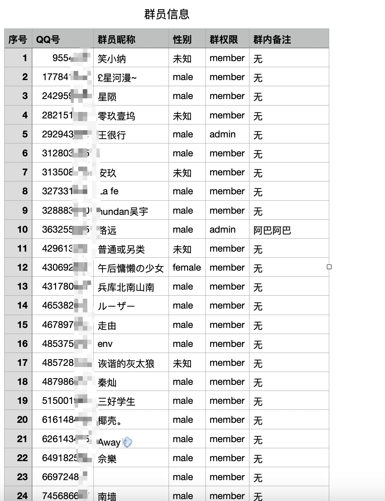
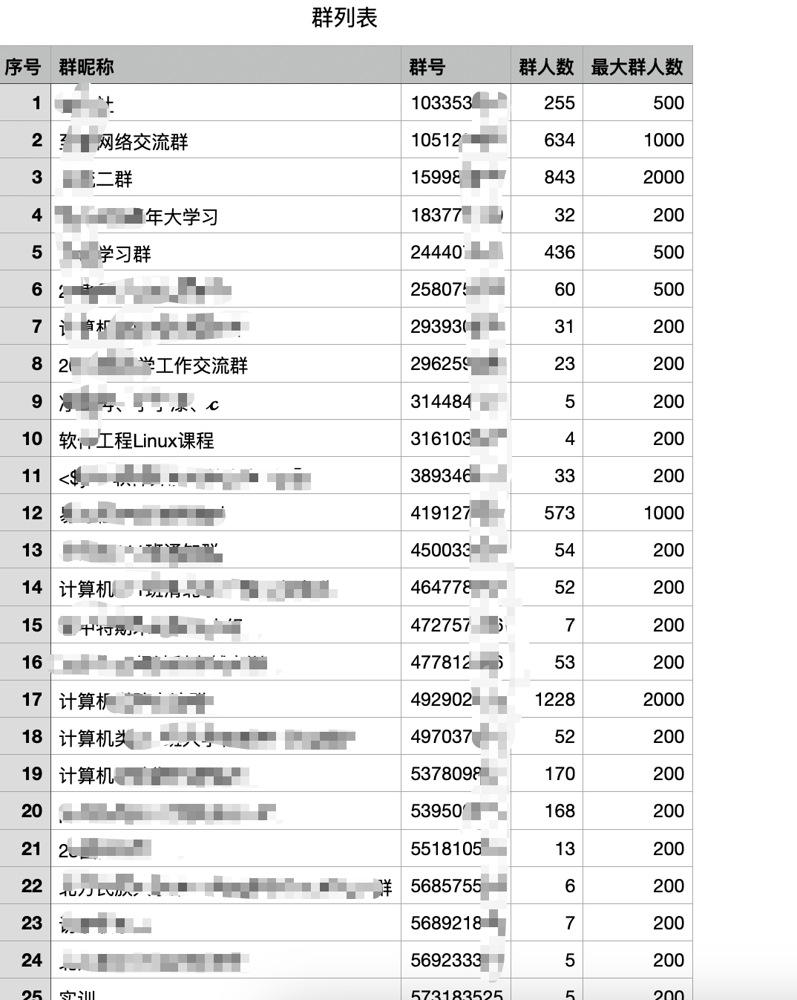
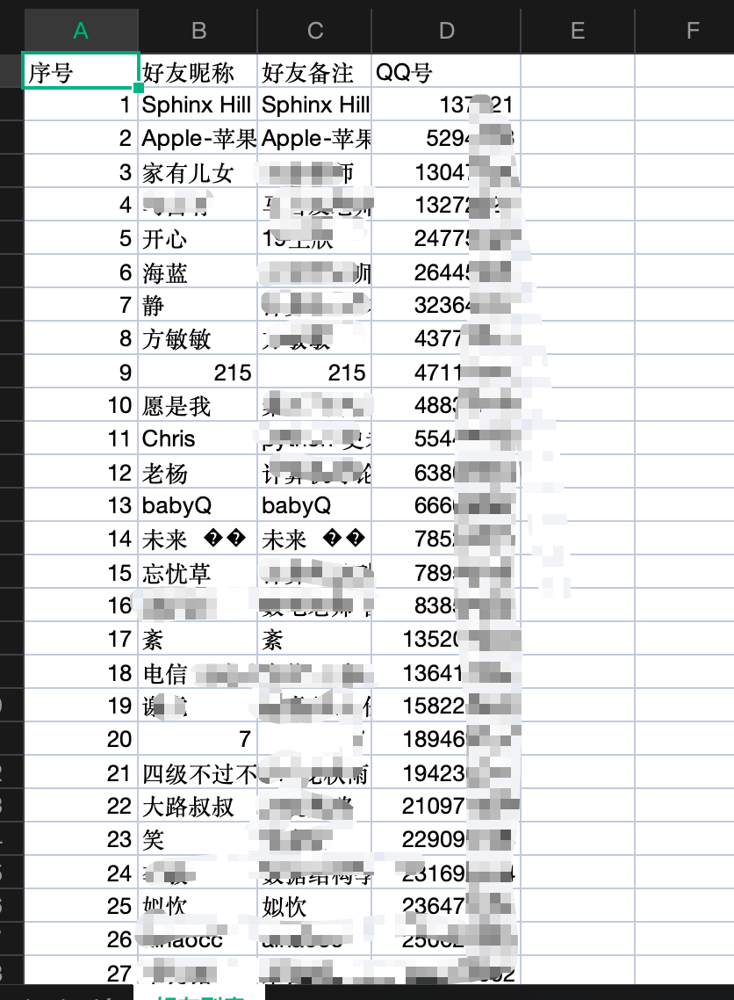

&emsp;一键导出 QQ 号里的所有好友信息、所有群消息、所有群内的群成员消息。







### 使用

##### 1. 配置 Go 环境

&emsp; go >= 1.21.5

##### 2. 启动 CqHttp

&emsp;参考项目[https://github.com/Mrs4s/go-cqhttp](https://github.com/Mrs4s/go-cqhttp).

&emsp;启动教程:[https://docs.go-cqhttp.org/guide/quick_start.html](https://docs.go-cqhttp.org/guide/quick_start.html)

##### 3. 根据需要修改配置

##### 4. 运行

&emsp;进入到根目录并执行

```
cd qq-info
go run main.go
```
